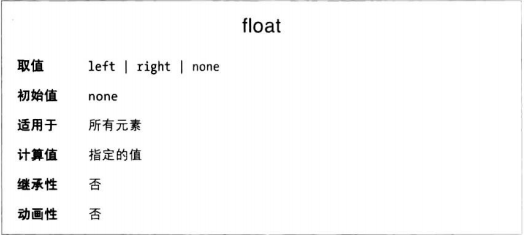
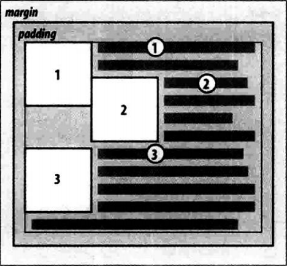
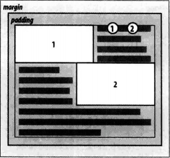
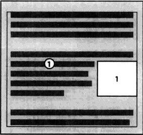
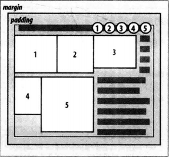

在CSS中，浮动通过float属性实现。



例如，把图像浮动到左侧，可以使用下述标记：
```HTML

```

这个图像将“浮动”到浏览器窗口左边，文本绕着图像流动。

### 浮动的元素

浮动元素后要注意几件事。首先，浮动的元素脱离了常规的文档流，不过对布局仍有影响。浮动元素的外边距不折叠。如果浮动的是非置换元素，腰围元素设定宽度，否则根据CSS规范，元素的宽度趋近于0。

**根本不浮动**
除了lfet和right之外，float属性还可以取none，作用是彻底禁止元素浮动。

### 浮动详解
浮动元素的容纳块是最近的块级祖辈元素。
此外，不管元素是什么类型，浮动后得到的都是块级框。在布局中，浮动元素就像div一样，与为浮动元素声明display: bolck没什么区别。

浮动元素的位置由一系列规则约束，这些规则与计算外边距和宽度的方式略有相似
* 浮动元素的左右外边界不能超过容纳块左右内边界
* 浮动的元素的高度不会互相重叠。如果连续两个浮动元素方向相同且有重叠，那么第二个元素会紧靠在第一个元素与浮动方向相反的外边界。
  
* 浮动元素的宽度也不会重叠。如果连续两个浮动元素方向相反且有重叠（宽度之和大于容纳块的宽度），第二个元素会紧靠在第一个元素的下外边界。
  
* 浮动元素的顶边不能比父元素的内顶边高。如果浮动元素在两个折叠的外边距之间，在两个元素之间放置它的位置时，将视其有个块级父元素。
* 浮动元素的顶边不能比前方任何一个浮动元素或块级元素的顶边高。
* 浮动元素的顶边不能高于文档源码中出现在浮动元素之前的元素生成的框体所在的行框的顶边。
  
* 空间不够时，浮动元素被挤到新的一行。
  
* 浮动元素必须放在尽可能高的位置上。浮动元素的顶边应该与其标签所在的哪一行的行框顶边平齐。
* 左浮动元素必须尽量向左移动，右浮动元素必须尽量向右移动。位置越高，移动距离越远。

### 浮动元素与内容重叠
如果浮动元素与常规流动的内容出现重叠会怎样？例如右浮动元素的左外边距为负数，就会出现这种情况。

CSS 2.1阐明了具体规则：
* 行内框与浮动元素重叠时，其边框、背景和内容都在浮动元素之上
* 块级框与浮动元素重叠时，其边框和北京在浮动元素背后渲染，而内容在浮动元素之上。