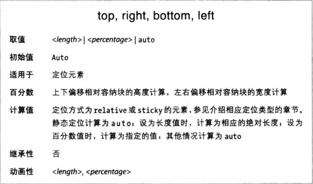

前一节介绍的五种定位方式，除了默认的static，其他四种都使用四个属性指定定位元素的各边相对容纳块的偏移。这四个属性称为偏移属性，对定位由极大影响。

这些属性指定距容纳块最近的边的偏移。例如top属性指定元素上外边距边界距离容纳块顶边多远。

定位元素的外边距边界偏移后，元素的一切都随之移动，包括外边距、边框、内边距和内容。

使用负的偏移值可以把元素定位到容纳块的外部。

除了长度属性和百分比，偏移属性还可以设为auto，这是默认值。auto的定位不定，根据定位类型而变。