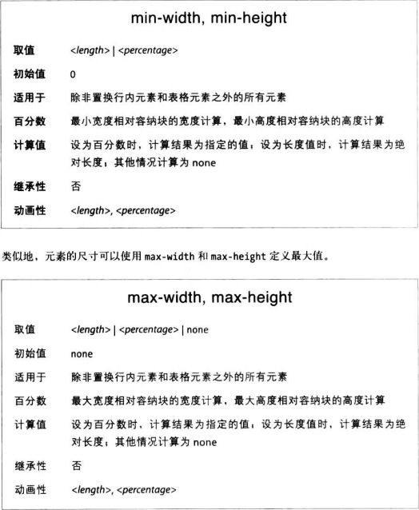

很多情况下，确定把元素定位在何处之后，可能还有声明元素的宽度和高度。有时你想自行限定1定位元素的高度和宽度，还有一些情况下则交由浏览器自动计算。

### 设定宽度和高度
如果想为定位元素指定具体的高度或宽度，使用wdith或height属性。

虽然有时必须为元素设定width和height，但定位元素却不强制要求。例如，如果使用偏移属性限定了元素四边的位置，width和height值便能从偏移中推出。假设我们想元素占满容纳块左半边：
```CSS
div {
    top: 0;
    bottom: 0;
    left: 0;
    right: 50%
}
```

然而，如果添加了内边距、边框或外边距，height和width属性对结果的影响就大了：
```CSS
div {
    top: 0;
    bottom: 0;
    left: 0;
    right: 50%;

    width: 50%;
    height: 100%;
    padding: 2px
}
```
上述声明的道德结果是，定位元素超出容纳块的边界。这是因为，内边距增加到内容区上，而内容区的尺寸由width和height属性值确定。如果想要内边距又不想让元素超出容纳块，可以不设置width和height，或者box-sizing属性设为border-box，此时width和height包含内边距。

### 限制宽度和高度
可以使用下述属性限制元素的宽度和高度。



这几个属性的名称已经表明其作用，无需过多解释，唯一一点就是都不能为负数。

极值属性的一大优势是，可以放心混用不同9年过的单位。可以使用百分数设定尺寸，然后使用长度限定极值，或者反过来。