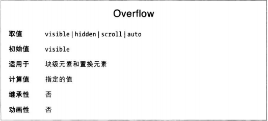

假设有个尺寸固定的元素，内容在里面放不下，可以使用overflow属性处理。

默认visible的意思是，超出元素框的内容是可见的，通常会导致内容超出所在的元素框吗，但是对元素框的形状没有影响。

如果设为scroll，元素的内容会在元素框的边界处裁剪，但是会出现一个滚动条，可以用来查看溢出内容。
设为scroll时，即便元素的尺寸足够显示全部内容，滚动条也可能出现。

如果设为hidden，元素内容在边界处裁剪，且无法查看。

