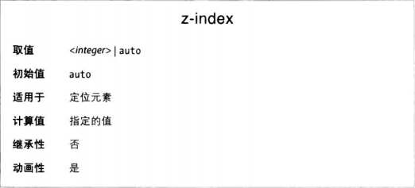

### 绝对定位元素的容纳块

绝对定位的元素完全从文档流中删除，其位置相对容纳块块确定，外边距的边界使用偏移属性划定。

绝对定位的容纳块是position属性值不是static的最近的祖辈元素。通常，创作人员选定用绝对定位元素的容纳块的元素后，就回吧posotion值设为relative，而且不设置偏移。

```CSS
.contain {position: relative}
.contain > .son {position: absolute}
```

需着重说明一点，绝对定位的元素是其后代元素的容纳块，因为它的position就不是static。因此我们可以绝对定位一个元素，再绝对定位它的子元素。

### 自动确定边界的位置
绝对定位一个元素时，如果除bottom之外的某个偏移属性被设为auto时，取元素未定位时对应的边界所在位置对齐。

### 非置换元素的位置和尺寸
一般来说，对元素的尺寸和位置最根本的影响来自容纳块。

以定位元素的宽度和横向位置为例，满足以下等式
left + right + margin-left/right + padding-left/right + width = 容纳块宽度。

首先，如果left、widt和right都设为auto，左边界放在静态位置，元素内容区宽度恰好放得下内容。非静态定位属性设为auto的意思是占据余下的位置。

如果七个属性都设定了非auto值但没占满父元素宽度，那么将忽略right属性值，补上差值。

一般来说，如果只有一个属性值时auto，通过那个属性补足本节前面给出的等式。

目前讨论的都是横轴上的行为，不过纵所用的规则与之十分类似。

在绝对定位下，一对外边距为auto时自动设为相等的值，因此可以实现纵向居中（只要top和bottom不是auto且相等）。而在常规文档流中纵向外边距设为auto会是0。

如果绝对定位元素的纵向尺寸过约束，bottom将被忽略。

### Z轴上的位置
终有那么一一个时刻，两个元素会出现在相同的位置，视觉上的效果，使用z-index属性控制重叠优先级。



z-index值可以设为任何整数，包括负数。z-index越大，元素越接近读者，叠加优先级越高。

为元素设定z-index后，元素便确立了自己的局部堆叠上下文。这意味着所有后代元素的堆叠次序都相对祖辈元素而言，不管zindex多少都显示在父元素前面。

CSS规范规定：z-index: auto可以视作 z-index: 0