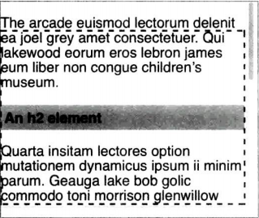

粘性定位的偏移属性用于定义相对容纳块的粘滞定位矩形。

```CSS
#scrollbox {
    overflow: scroll;
    width: 15em;
    height: 18em
}

#scrollbox h2 {
    position: sticky;
    top: 2em;
    bottom: auto;
    left: auto;
    right: auto
}
```



图中的虚线是偏移属性定义的粘滞定位矩形。h2一直在常规文档流中，随着滚动移动。当h2与虚线顶边接触时，h2粘滞在那里，就像是绝对定位了一样。如果向相反方向滚动，把h2在常规文档流中的位置移到矩形顶边以下，h2将与矩形分离，回到原本在常规文档流中的位置。

scrollbox元素没有声明position属性，只使用overflowe：scroll为粘滞定位元素创建了一个容纳块。这是不使用position创建容纳块的一例。

粘性定位元素的粘滞边对应的偏移属性不能是auto。如果定义多个偏移属性且值都不是auto，那么各边都将变成粘滞边。

**粘性定位就是用偏移属性画了一个框，元素不能滚动出这个框的偏移属性不是auto的边**

如果滚地到某一位置触发多个粘滞定位的元素，这些元素会堆叠到一起，重叠优先级由z-index控制。