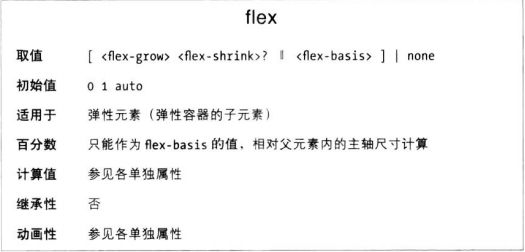
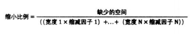

弹性布局最突出的一点是能把弹性元素变得具有“弹性”，即在主轴方向上调整弹性元素的宽度或高度、占满可用空间。弹性容器根据弹性增长因子按比例分配额外的空间，或者根据弹性缩减因子按比例缩小弹性元素，以防溢出。

增长因子和缩减因子由弹性元素的flex简写属性声明，或由构成简写属性的单个属性定义。

一切都由flex属性控制，它是flex-grow、flex-shrink和flex-basis的简写形式，且强烈建议始终使用简写flex。

flex属性指定确定弹性长度的各要素。这里所说的“长度”是弹性元素在主轴方向上的长度。弹性元素所在框体尺寸由flex决定，而不是确定主轴尺寸大小的属性。

flex-basis是各弹性元素的初始主轴尺寸，如果设置为非auto会覆盖元素自身的width或者height。

### flex-grow属性
flex-grow属性定义由多余空间时是否允许弹性元素增大，以及允许增大且由空余空间时，这些空间按什么比例分配给各弹性元素。

flex-grow值始终是一个非负数。
如果弹性元素中有多余空间，多出的空间将根据各弹性元素的非零增长因子按比例分配给各个弹性元素。

每个弹性元素分配到的宽度 = （自身增长因子 / 同辈所有弹性元素增长因子之和） * 弹性容器多余空间。

### 在flex属性中设定增长因子
flex属性值中第一个有效的正数设定的是增长因子。如果声明flex属性但没有设置增长或缩减因子，默认1；但是如果没有声明flex，增长和缩减因子默认是0.

### flex-shrink属性
缩减因子定义空间不足以放下所有弹性元素时，每个弹性元素按什么比例缩小，挤出空间。

flex-shrink始终是非负数。

每个弹性元素需要缩小的宽度 = （自身缩减因子 / 同辈所有弹性元素缩减因子之和） * 弹性容器缺少空间。

在缩小过程中，如果弹性元素中的内容不能换行也不能在主轴方向上缩小，且弹性元素缩小到了容纳内容的最小宽度，那么此时该元素弹性因子自动变为0，即不再缩小，需要缩小的空间由其余弹性元素按比例出。

### 根据宽度和缩减因子按比例缩小
如果各弹性元素初始宽度不相同，弹性元素根据缩减因子和元素的宽度按比例缩小。

每个弹性元素缩小的量 = 缩小比例 * 元素的缩减因子 * 元素初始宽度。
