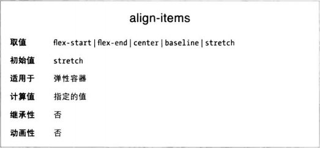
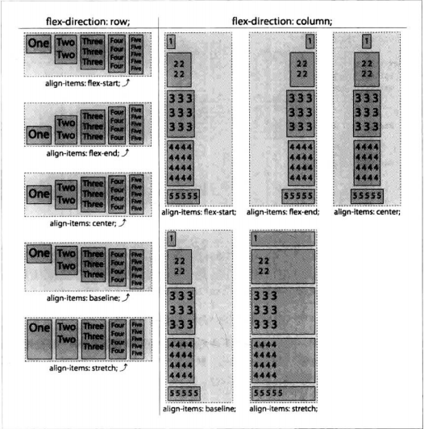

justify-content定义弹性元素在弹性容器主轴方向上的对齐方式，而align-items属性定义的是在垂轴方向上的对齐方式。与justify-content一样，align-items应用在弹性容器上，而不能应用到单个弹性元素上。

使用align-items属性，可以把所有元素都向垂轴的起边、终边或中线对齐。

应用stretch时，垂向尺寸最大的弹性元素保持当前尺寸，其他弹性元素的尺寸增大，变成与最大的那个弹性元素一样。

有一点需要注意，如果为弹性元素显式设定了垂轴方向上的尺寸，那么弹性元素就是不可拉伸的，stretch对其尺寸没有影响。

### 基线对齐
baseline值有点复杂。弹性元素中，基线与垂轴起边那一侧的外边距边界之间距离最远的元素，其外边距的外边界与弹性元素行垂轴起边那一侧的边对齐，其他弹性元素的基线与那个元素的基线对齐。

这么说有点抽象，举个例子。默认的从左往右排列情况下，看哪个弹性元素的基线到它自己margin-top外边界的距离最远，把它往上移到顶住弹性容器顶边，然后其他元素的基线都对齐它的基线。