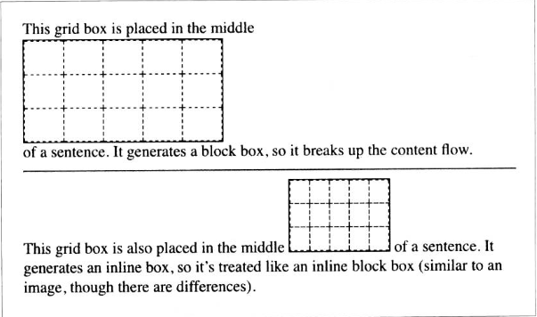

创建栅格的第一步是定义栅格容器（grid container）。这与定位所用的容纳块和弹性盒布局中的弹性容器作用很像：栅格容器为其中的内容定义一个**栅格格式化上下文 （grid formatting context）**。

栅格布局从弹性盒布局上沿袭了相当多概念，比如栅格容器的子元素是栅格元素，就像弹性容器的子元素是弹性元素。栅格元素自身也可以变作栅格容器，因此它的子元素将变成嵌套栅格的栅格元素。栅格之中可以嵌套栅格，而且层级不限。

栅格有两种：常规栅格，使用display: grid，生成块级框；行内栅格，使用display: inline-grid，生成行内块级框。

虽然display：grid创建的是块级栅格，但严谨的规范明确指出：“栅格容器不是块级容器”。首先，浮动元素不会打乱栅格容器。意味着栅格不会移动到浮动元素的下方，而块级容器会；其次，栅格容器的外边距不与其后代的额外边距折叠，而块级框会。

有些CSS属性和功能不能用在栅格容器和栅格元素上：
* 栅格容器上所有的 column 属性都被忽略
* 栅格容器没有 ::first-line 和 ::first-letter伪元素
* 栅格元素（而非容器）上的 float 和 clear 属性将被忽略。然而float属性对栅格元素的display属性的计算值是有影响的，因为栅格元素的display值在变成栅格元素之前计算。
* vertical-align属性对栅格元素不起作用，不过可能更会影响栅格元素中的内容。