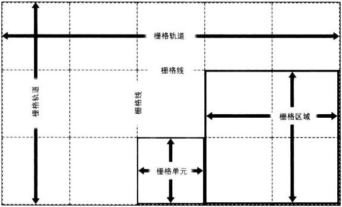

栅格容器是确立栅格格式化上下文的框体，即定义一个栅格区域，其中的元素根据栅格布局规则排布。

栅格元素是在栅格格式化上下文中参与栅格布局的东西，通常是栅格容器的子元素，但也可以是匿名文本。

在使用栅格属性的过程中，可能会创建或引用栅格布局的多个核心组件:

最重要的组件是栅格线，栅格线的位置定义好之后，其他栅格组件也就随之而现了：
* 栅格轨道（grid track）指两条相邻的栅格线之间夹住的整个区域，从栅格容器的一边延伸到另一边，即栅格行或栅格列。
* 栅格单元（grid cell）指四条栅格线限定的区域，内部没有其他栅格线贯穿。这是栅格布局中区域最小的单位。栅栏格单元不能直接使用CSS栅格属性处理，即没有属性能把一个栅格元素放在指定的栅格单元里。
* 栅格区域（grid area）指任何四条栅格线限定的矩形区域，由一个或多个栅格单元组成。最小的栅格区域就是一个栅格单元，最大的栅格区域是栅格中所有的栅格单元。栅格区域能使用CSS栅格属性直接处理，定义好栅格区域后即可在其中放置栅格元素。

特别注意，栅格轨道、栅格单元和栅格区域都完全由栅格线构建，不一定非要有相应的栅格元素存在。栅格区域中不一定充满栅格元素，完全可以让部分栅格单元空着。此外，栅格元素还可以重叠，方法是定义重叠的栅格区域，或者把栅格线重叠起来。

另外需要注意一点是，栅格线数量不限，并且可以只定义一个方向上的栅格线，即只定义栅格行或栅格列。然而，如果栅格元素无法放入你定义的列或行轨道，那么栅格系统将自动添加栅格线和轨道。