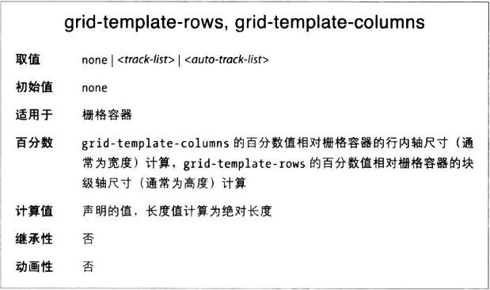
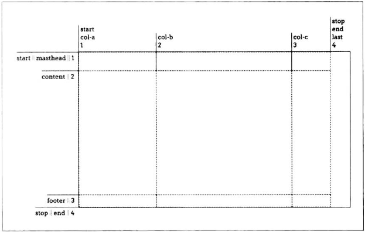
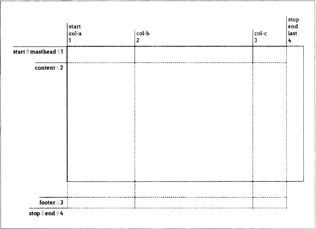
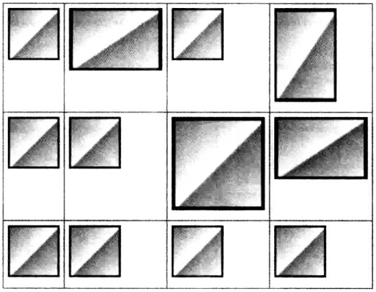
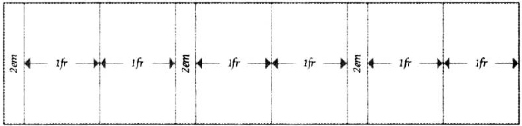
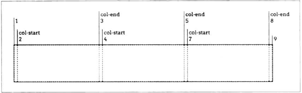
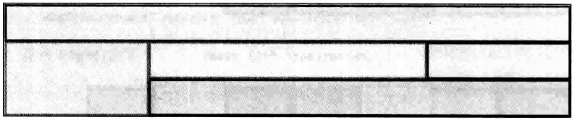

放置栅格线的方式太多了，而且不同的方式使用的语法有细微差别。




使用这两个属性可以大致定义栅格模版（grid template，CSS规范称之为explict grid，显式栅格）中的栅格线。栅格中的一切都依赖栅格线，如果放置不当，整个布局就会轻易垮掉。

栅格线始终可以使用数字引用，创作人员也可以为其命名。在CSS中可以使用数字引栅格，也可以i使用为其指定的名称，又或者二者混用。

一条栅格线可以有多个名称，可以使用任何一个名称引用它。

定义栅格模版的值有很多方式，下面从易到难逐一讨论。

### 13.3.1 宽度固定的栅格轨道
”宽度固定“的栅格线指栅格线之间的距离不会随栅格轨道中内容的变化而变化。

以下声明定义的是三个宽度固定的栅格列：
```css
#grid {
    display: grid;
    gird-template-columns: 200px 50% 100px
}
```
虽然第二列的尺寸会随栅格容器的尺寸变化，但不会随这一列中栅格元素的内容而变。不管第二列中的内容多宽多窄，列的宽度适中为栅格容器的一半。

为栅格线命名，只需要把想用的名称放在值中恰当的位置，并在两侧加上方括号，数量不限。
```css
#grid {
    display: grid;
    grid-template-columns: [start col-a] 200px [col-b] 50% 100px [stop end last]
}
```

行栅格线的放置方式与列完全一样：
```css
#grid {
    display: grid;
    grid-template-columns: [start col-a] 200px [col-b] 50% 100px [stop end last];
    grid-template-rows: [start masthead] 3em [content] 80% [footer] 2em [stop end];
}
```



有几点需要注意。首先行和列中都有名为start和end的栅格线，这完全没问题，行和列不共用命名空间。其次，content轨道的百分比数值，相对栅格容器的高度计算。

你可能以为使用100%能让一行占满全部空间，实则不然。如图所示，content行轨道高度与栅格容器高度相等，之后的footer行诡被完全推到容器外部。**（只会往后挤，不会往前挤）**



### 13.3.2 弹性栅格轨道
目前所见的栅格轨道都不具有弹性，其尺寸长度由长度值或栅格容器的尺寸决定。

弹性栅格轨道的尺寸基于弹性容器中非弹性轨道以外的空间确定，或基于整个轨道中的具体内容而定。

#### 份数单位
如果想把余下空间分成一定份数分配给各栏，可以使用fr单位。处理fr单位的方式是，拿可用空间除以fr值只和，各轨道的尺寸等于fr值所对应的份数。**先给固定宽度的轨道分配空间，剩下的空间按比例分配给用fr的弹性轨道**

最简单的情况是把容器平均分成几等份。比如想要四列：
```css
grid-template-columns: 1fr 1fr 1fr 1fr;
```
就这个例子而言等效于
```css
grid-template-columns: 25% 25% 25% 25%
```

现在假设我们想增加一列，仍然确保每一列宽度相等。如果是用百分数要重写整个值，把各列尺寸改为25%，而使用fr只需要再加一个1fr即可
```css

grid-template-columns: 1fr 1fr 1fr 1fr 1fr
```


某些列的尺寸固定，而部分空间弹性伸缩时，份数单位特别有用，比如：
```css
grid-template-columns: 15em 1fr 10%
```
浏览器会为第一和第三个轨道分配固定宽度，余下空间全都分给中间的轨道。

这样得到的栅格既有宽度固定的列也有弹性伸缩的列。

我们可以更进一步，把可用空间分成任意多份：
```css
grid-template-columns: 15rem 4.5fr 3fr 10%
```

#### 根据内容设定轨道的尺寸
如果想把页面中的某些部分对齐起来，而无法确定各部分有多宽或多高呢？这时可以使用 min-content 和max-content 。

max-content的意思是”占据 内容所需的最大空间“、”宽度尽量大以防换行“。

min-content的意思是”占据 够显示内容的最小空间“。对文本来说，宽度会尽量窄，只保证最长的单词能在一行里完整显示。

这两个关键字的强大之处在于，它们将应用于整个栅格轨道上。例如，把一列的尺寸设为max-content，整个轨道的宽度都与列中最宽的内容一样。


每一行的高度都与行轨道中最高的图像相等，每一列的宽度都与列轨道中最宽的图像相等。


#### 根据轨道中的内容适配
除了关键字 max-content和min-content之外，还可以使用 fit-content() 函数已简练的方式表达特定类型的尺寸模式。

fit-content()函数的参数为一个长度或一个百分数，规范给出的伪公式为：
```js
fit-content(argument) => min(max-content, max(min-content, argument))
```
这个公式基本意思是：先确定min-content和参数哪个大，取两者中的较大值与max-content比较，取较小值。**（min-content肯定比max-content小，可以理解为取三者按大小排列的中间值）**

例如：
```css
#grid {
    display: grid;
    grid-template-columns: 1fr fit-content(150px) 2fr;
}

#grid2 {
    display: grid;
    grid-template-columns: 2fr fit-content(50%) 1fr;
}
```

#### 13.3.4 重复栅格线
如果你想创建的栅格中各栅格轨道的尺寸是一样的，可以用repeat(),无需一个个输入。

假设想创建十个列轨道，每个宽度5em：
```css
#grid {
    display: grid;
    grid-template-columns: repeat(10, 5em);
}
```

回到的尺寸可以是任何值，min-content和max-content，fr和auto等，而且不限于只提供一个值。
姐设想定义的列结构为2em-1fr-1fr，重复三次：
```css
#grid {
    display: grid;
    grid-template-columns: repeat(3, 2em 1fr 1fr)
}
```



repeat()函数中几乎可以使用任何值。下列示例直接摘自栅格规范：
```css
#grid {
    display: grid;
    grid-template-columns: repeat(4, 10px [col-start] 250px [col-end] 10px);
}
```

在这个例子中，一个10像素宽的轨道，一条具名栅格线，一个250像素宽的轨道和另一条具名栅格线重复了四次，最后还有一个10像素宽的轨道。栅格线的名称无需独一无二。


重复具名栅格线时要注意一点，即两条相邻的具名栅格线将合并为一条具有两个名称的栅格线。下列两个声明是完全等效的：
```css
grid-template-rows: repeat(3, [top] 5em [bottom])
grid-template-rows: [top] 5em [bottom top] 5em [top bottom] 5em [bottom]
```

#### 自动填充的轨道 
还有一种方法能重复简单的模式直到盛满整个栅格容器为止，在repeat()中使用auto-fill关键字。

假如想一直重复前面的模式直到没有空间为止：
```css
gird-template-rows: repeat(auto-fill, [top] 5em [bottom])
```
对于11em高的栅格容器来说，等效于：
```css
grid-template-rows: [top] 5em [bottom top 5em [bottom]
```
（只够重复两次）

自动重复的局限是，只能有一个可选的栅格线名称、一个尺寸固定的轨道和另一个可选的栅格线名称。因此 [top] 5em [bottom]是这种模式下值最多的情况。不能重复多个轨道，也不能重复尺寸弹性变化的轨道。（重复几次1fr才能填满容器，一次不就够了，没意义）。

在一个轨道模版中只能有一个自动重复的模式，repaet(auto-fill, ...)不能有多个。

然而，固定数量的重复模式可以与自动填充模式一起使用：
```css
grid-template-columns: repeat(3, 20em) repeat(auto-fill, 2em)
/* 反过来也可以 */
grid-template-columns: repeat(auto-fill, 2em) repeat(3, 20em)
```
栅格布局的算法是先为固定尺寸的轨道分配空间，余下的空间才使用自动重复的轨道填充。

auto-fill自动重复的模式至少会出现一次，哪怕在栅格容器中放不下了。而且只要空间足够，能重复几次就几次，哪怕某些轨道中没有内容（比如自动填充五列，但是只有前三列有内容）。

而使用auto-fit，没有栅格元素的轨道将被去除，除此之外和auto-fill的行为一样。


#### 栅格区域
可以使用grid-template-areas属性把栅格画出来，为了好玩或者当作代码的参照。


先看一个例子：
```css
#grid {
    display: grid;
    grid-tremplate-areas:
        "h h h h"
        "l c c r"
        "l f f f";
}
```

就这么明显，字符串中的字母用于定义栅格区域的形状，相邻且相同的字母连成一格，但只能是矩形，不然整个声明无效。不限于单个字母，字符串也可以。