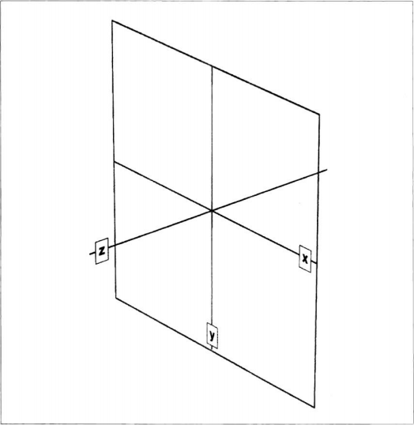
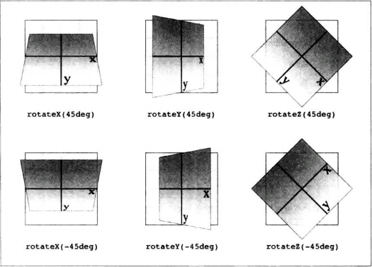

首先是笛卡尔坐标系，也就是通常说的x\y\x坐标系。在CSS中，这个坐标系使用三个周表示：x轴（横轴），y轴（纵轴）和z轴（深度轴）。

2D变形只需关注x轴和y轴。按约定，x轴上正值在右，负值在左。类似的，y轴上的正值沿纵轴向下，负值沿纵轴向上。

真正需要注意的是，每个元素都有自己的参照系，各轴都相对自身而动。也就是说，如果旋转了元素，轴哦也随之旋转。旋转之后再变形，是相对旋转后的轴计算。

提到旋转，就引出了CSS变形功能使用的另一个坐标系--球坐标系，用于描述3D空间中的角度。

在2D变形中只需关注全周360度极坐标系，即由x轴和y轴构成的平面。对旋转来说，2D旋转其实是绕z轴旋转。

