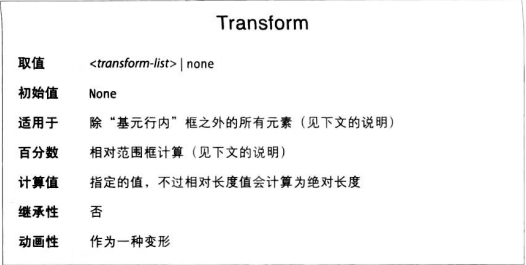
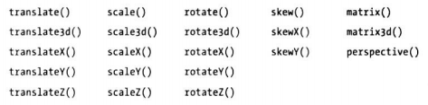
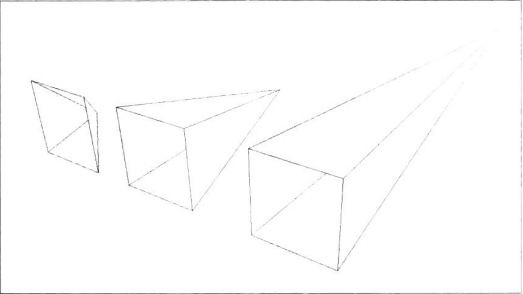
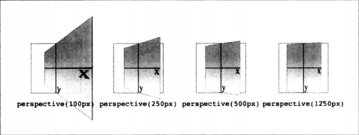

变形其实只有一个属性，不过有几个辅助属性用于控制如何变形。先从主要属性入手



先说明什么是范围框。受CSS控制的元素，其范围框是边框框，即元素边框的外边界。也就是说，计算范围框时，轮廓和外边距不算在内。

注意，变形的元素有自己的堆叠上下文。经过缩放的元素kennel比变形前大或小，但是元素在页面上所占的空间与变形前保持不变。这一点对所有变形函数都成立。

\<transform-list>这个占位符表示一个或多个变形函数，一个接一个，中间以空格分隔，像下面这样
```CSS
#example {transform: rotate(30deg) skewX(-25deg) scaleY(2)}
```
变形函数一次只处理一个，从左往右。从头到尾的处理顺序是很重要的，顺序变了，得到的结果可能大不相同。
注意，有多个变形函数时，每个都要正确设置，确保全部有效，不然整个值都将失效。

**变形函数**



**平移函数**
平移变形指沿着一个轴或多个轴移动。值为长度时，移动固定距离；值为百分比数时，相对元素自身尺寸计算。

如果想同时沿x轴和y轴移动，使用translate()更方便。第一个值是沿x轴的移动量，第二个值是沿y轴的移动量。只写一个值那就是x，y为0。

translateZ()沿着z轴平移元素，只接收长度值。其实任何与z轴有关的值都不可以使用百分数。

translate3D()这个简写属性能同时设定x轴、y轴和z轴平移量。不同的是，translate3D()的值少于三个时，没有默认值，会直接无效。

**缩放函数**
缩放变形把元素放大或缩小，值都是无单位的正数，表示倍数，不能是百分数。

scaleX()在x轴放大，scaleY()在y轴放大。scale()第一个值在x轴放大，第二个值在y轴放大，只传一个，y轴默认0. scaleZ()在z轴放大，scale3D()能同时在xyz轴放大，必须是三个有效值不然无效。

**旋转函数**
旋转函数绕着某个轴旋转元素，或者绕3D空间中的一个向量旋转元素。旋转变形有四个简单的函数，以及一个稍微复杂，专门用于3D旋转的函数。

rotate(), rotateX(), rotateY()和rotateZ()都只接受一个值，即角度，由一个数字和一个有效的角度单位（deg，grad，rad和turn）表示。

rotate()和rotateXZ()等效，都是绕z轴转。


如果你了解向量，想在3D空间中旋转元素，使用rotate3D()。前三个值指定3D空间中向量的x、y、z分量，第四个值是角度值，指定绕向量旋转的量。

**倾斜函数**
倾斜函数沿x轴或者y轴倾斜元素，不能沿着z轴或3D空间中的向量倾斜。
skew(), skewX()和skewY()，参数是一个角度值，不多说了。注意，skew(a, b)和skewx(a) skewY(b)不相同。

**视域函数**
在3D空间中改变元素的形态，基本上都要赋与元素一定的视域。prespective()为元素赋予前后深度。





视域值必须是正数。

此外要注意，perspective()函数在变形函数列表中的位置十分重要。上述例子的代码中，perspective()函数在rotateY()函数前面。如果调换顺序，未应用视域就旋转了，四个示例将得到一摸一样的效果。
因此，如果想再变形函数列表中设定视域，一定要把perspective()放在首位。这一点特别重要，请牢记，transform函数的编写顺序十分重要。