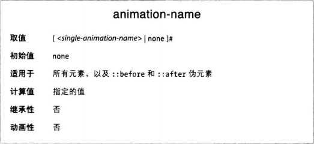
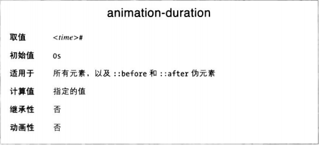
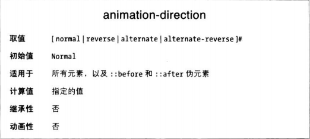
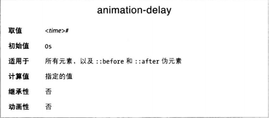
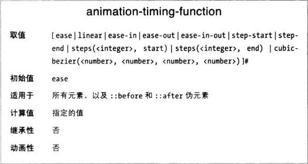
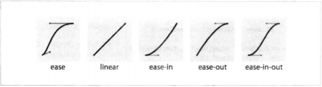
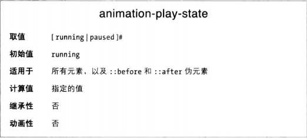
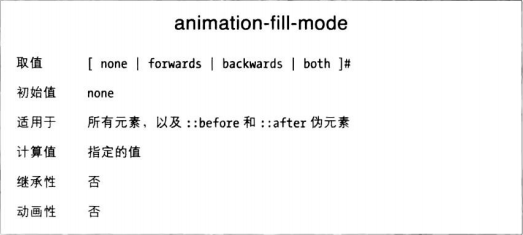

定义好关键帧动画便可以把动画应用到元素或伪元素上了。为了把动画附加到元素上，并控制动画的播放过程，CSS提供了多个相关属性。若想保证动画效果能显示出来，至少要指明动画的名称，以及持续时间（不然瞬间结束）。

在元素上声明动画属性的方式有两种：一种是单独声明各个属性，另一种是使用animation简写属性一次性声明全部属性。

###指定动画名称
animation-name属性值为一个逗号分隔的列表，指定想应用的关键帧动画的名称。



```CSS
div {
    animation-name: change_bgcolor;
}
```
这个规则把刚刚定义的change_bgcolor动画应用到所有div元素上。

如果想应用多个动画，以逗号分开多个@keyframes标识符：
```CSS
div {
    animation-name: change_bgcolor, round, W;
}
```

如果指定的一系列关键帧标识符由一个不存在，不会导致整条声明无效，只忽略那个不存在的动画。但是如果通过脚本编程添加了那个原本不存在的动画，那么在它出现的那一刻将应用到元素上。

如果animation-name属性值中以逗号分隔的多个关键帧动画中有重复的属性，后面的覆盖前面的。为相同的属性设置的多个动画在同一时刻播放，起作用的是在animation-name属性值中后列出的动画。（注意不是相同的关键帧选择符定义的属性值覆盖哦，是整个动画的都覆盖。比如后面的动画中某个关键帧声明了background-color的值，那么前面所有动画声明的background-color都无效。）

遇到没有定义0%或100%关键帧的情况，使用的计算值可能是元素本身的属性值，也可能是animation-name列出的前一个动画中的属性值。现在规范规定的是后者。

###定义动画时长



animationduration属性定义动画中全部关键帧完成一次循环所用的时间长度，单位为s或者ms，必须带单位，不能为负。

如果有多个动画，可以分别设置持续时间
```CSS
div {
    animation-name: change_bgcolor, round, W;
    animation-duration: 200ms, 100ms, 0.5s
}
```

如果一组逗号分隔的持续时间中有无效的值，整个声明都失效。

如果animation-duration和animation-name列出的值数量一致，处理规则与transition时候讲的一致。反正duration多了忽略，少了就是成组复制，很抽象，避免给值的数量不一致最好。

### 声明动画的迭代次数
如果希望动画重复播放多次，使用animation-iteration-count属性设定。


如果animation-iteration-count值不是整数，动画将在最后一次循环的中途结束。

不允许设为负值，如果提供的值无效，将重置为1。

有趣的是可以设为0，和animation-duration: 0s 一样，看上去啥也没有，但是会触发animationstart和animationend事件。

和animation-duration一样可以声明多个，以逗号分隔的列表。数量与animation-name不一样时规则还是那样。无效的值也将导致整个声明失效。

###设置动画的播放方向
使用animation-direction属性可以控制动画是从0%到100%播放，还是从100%向0%播放。



可取的值有四个：
* normal：正正正。。。
* reverse：反反反。。。
* alternative：正反正反。。。
* alternative-reverse：反正反正。。。
  
### 延迟播放动画
animation-delay属性定义浏览器把动画附加到元素上之后等待多久开始第一次迭代，单位为s或ms。



如果设为负值，动画立即开始播放，且从中途开始。

延迟会贯穿所有迭代而不是只有一次。如果设置动画循环10次，延迟为-600ms，而持续时间为200ms，那么元素将从第四次迭代的开头立即开始。

可以利用delay把多个动画串在一起，一个结束了下一个开始。

### 18.4.6 动画事件
用到在再看吧

### 改变动画的内部时序

与transition-timing-function属性类似，animation-timing-function属性指明动画在一次迭代中如何演进。





**步进时序函数**
过渡时候讲过了。

**以动画形式改变时序函数**
animation-timing-function属性不支持动画，但是可以放在关键帧中，修改动画的当前时序。

如果放在@keyframes规则中定义的关键帧里，播放到当前关键帧时，其中声明的属性将使用animation-timing-function声明的新时序函数。新时序函数从那个关键帧开始生效，直到下一个覆盖默认时序或有animation-timing-function声明的关键帧。

关键帧中声明的animation-timing-function只针对当前关键帧中的属性有影响。只有播放到包含那些属性的关键帧时，新的时序函数才生效。

那么，在动画中途改变时序函数有什么用呢？比如一个小球弹跳的动画，弹起变慢下落变快，就需要每次切换时序函数，ease-in和ease-out来回切换。（具体例子看书）

### 设置动画的播放状态
如果想暂停和继续播放动画，可以使用animation-play-state属性。



有一点需要注意，在延迟阶段把它设置为paused，延迟计时也停止，设为running后重新计时。

### 动画的填充模式
animation-fill-mode属性定义动画播放结束后是否应用原来的属性值。



默认情况下，动画结束后所有属性还原。类似的，如果animation-delay为正值，动画不会立即改变属性值，而是在延迟结束触发animationstart事件后再开始。

使用animation-fill-mode属性可以定义触发animationstart事件之前和触发animationend事件之后动画如何影响元素。

设为backwards时，0%或from关键字中定义的恶属性值降在动画应用到元素上的那一刻起就起作用，而不是等待animation-delay时间结束。

forwards值的意思是动画迭代全部结束之后，当时的属性值继续应用在元素上。

both同时包含backwrads和forwards两个效果。