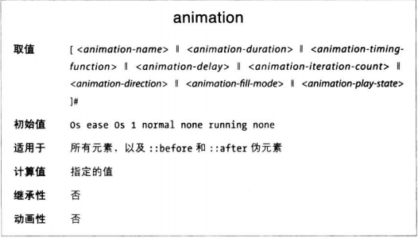

使用animation间歇属性，无需分别定义八个属性，在一行中就能为元素定义全部动画属性。

animation属性值为前述各动画属性的值，包括：
* animation-duration
* animation-timing-funcction
* animation-delay
* animation-iteration-count
* animation-direction
* animation-fill-mode
* animation-play-state
* animation-name

如果在简写属性中没有声明全部八个值，未声明的值将采用相应初始值。

简写属性中有些值的顺序是重要的。
其一，有两个时间相关的属性，分别是duration和delay。如果列出两个时间值，第一个始终为持续时间，第二个是延迟。
其二，animation-name位置也很重要。如果动画标识符的值与某个动画属性的值相同（不应该这么做，只是假设），那么animation-name应该放在最后。之前位置上的关键字，只要是某个动画属性的有效值，就回家定位相应属性的值。

综上所述，使用animation简写属性是个不错的主意。但是要记住，持续时间，延迟和名称的位置很重要，而且省略的值将被设为默认值。此外，最好别使用关键字作为动画的标识符。