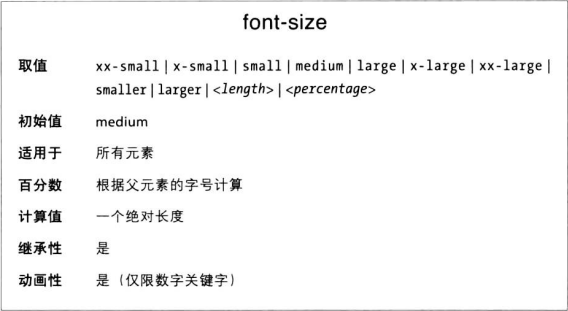

类似于font-weight属性的关键字bolder和lighter，font-size也有相对大小关键字，分别是larger和smaller，作用是增大和减小一号字体。不过我们首先要知道字号是如何确定的。

font-size属性与渲染结果之间的关系是由字体设计者决定的。字体的em方框指的是在没有行距（line-height）的情况下字体的两条基线之间的距离。而font-size的作用是为em方框提供一个尺寸，所以显示出来的字符不可能完全是指定的大小。

### 绝对大小
font-size支持绝对大小值有七个：xx-small、x-small、small、medium、large、x-large和xx-large。这几个关键字没有固定大小，都是相对而言的。

### 相对大小
关键字larger和smaller相对简单，它们按照父元素的字号大小增减一定比例。
与字重的相对值不同，字号的相对值没有上下限。因此，字号可以小于xx-small或大于xx-large。

### 百分比数和em
百分比数在某种意义上与相对大小关键字很像，始终根据继承子父元素字号计算。与前面讨论的关键字相比，百分比能更细致的控制字号。
此外，CSS海拔长度单位em定义为等效于百分数。对字号而言，1em与100%效果相同。下面两个规则得到的结果一样：
```CSS
p.one { font-size: 166% }
p.two { font-size: 1.6em }
```

###字号的继承
虽然CSS中的字号会继承，但是继承的是计算得到的（绝对）值，而不是百分数本身。

与相对大小关键字一样，百分数也会累积。
```CSS
p {font-size: 12px}
em {font-size: 120%}
strong {font-size: 135%}
```
这里strong的字号是12 * 1.2 * 1.35 = 19.44 px。

按比例缩放可能有一个问题。
```CSS
p {font-size: 80%}
```
假设文档中p标签嵌套了四层，那最内层的字号会是最外层的40.96%，嵌套的p一层比一层看不清。嵌套每深一层，字号就变成父元素的80%。

### 使用长度单位
font-size可以设为任何长度值
```CSS
p.one {font-size: 36pt}
p.two {font-size: 3pc}
p.three {font-size: 0.5in}
```
