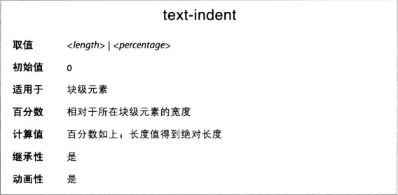
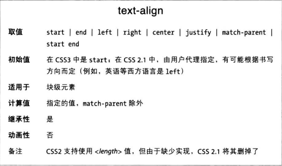
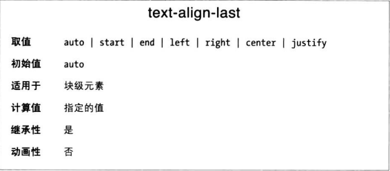

首先明确“块级”和”行内“两个术语：
* 块级方向指当前数学模式放置块级元素的方向。比如在英语中，块级方向从上到下，一个段落在另一个段落下方。
* 行内方向指的是块级元素中行内元素的书写方向。还以英语为例，行内方向从左至右。

### 缩进文本

text-indent属性通常把元素的第一行文本缩进指定长度，可以是负值。
```CSS
p {text-indent: 3em}
```

text-indent可以用在任何块级元素上，缩进将沿着行内方向展开。text-indent不能用于行内元素。

text-indent属性值可以是任何长度单位，包括百分数，相对于父元素的宽度计算缩进量。

### 文本对齐

text-align比text-indent还基础，控制着元素中各文本行的对齐方式。

left、right和cenbter三个值的作用从字面就能看出，靠左、靠右和居中。text-align只能用于块级元素，且不影响元素的对齐方式，只影响元素中的内容。

**起边和终边对齐**
CSS3之后，新的默认值是start，意思是文本与元素所在的行框起边对齐，从左往右的语言中是左边，从右往左的是右边。
类似地，end吧文本与行框的终边对齐。

**两端对齐**
justiy对齐方式作用是使文本每一行的两端都与父元素的边界对齐。单词与字母之间的空白会做调整，从而保证每一行的长度完全一致。

### 对齐最后一行

只要一行后面有强制换行，不管是不是在元素末尾都受这个属性控制（包括br导致的换行和元素结尾导致的换行）。

如果元素的第一行也是最后一行，那么text-align-last优先级比text-align高。
