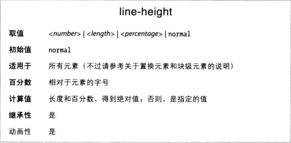
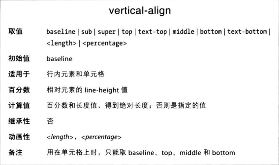

### 行的高度
行之间的距离受“高度“影响。这里说的高度是相对文本而言的。

line-height属性指行的基线之间的距离，与字号无关，决定着元素所在方框的高度是增还是减。



对块级元素而言，line-height定义元素中文本行基线之间的最小距离，不是定死的值，基线之间的距离可能比line-height值大。

**行的构成**
文本行中的每个元素构成一个内容区，其高度由字体的高度决定。随内容区出现的是一个行内框，不考虑其他因素其高度与内容区完全相等。line-height导致的行距是影响行内框高度的因素之一。

内容区高度是font-size，line-height是行内框，行内框比内容区高的部分分成两半，放到内容区的上部和下部。
行框是恰好包裹最高的那个行内框的顶端和最低的行内框的底端。


line-height越大，行框的空白部分越大，行距越大

**line-height的值**
使用默认值normal时，行之间的空间由用户代理计算，一般都是字体高度的1.2倍左右。
line-height的值可以是长度量（18px、2em），不过多数情况下首选纯数字。

em、ex和百分数相对元素的font-size值计算。

**行高的继承**
块级元素之间继承的行高有点复杂。从父元素继承line-height值时，根据父元素的字号计算，而不是根据子元素（也就是继承的是绝对的值）。
```CSS
body {font-size: 10px}
div {line-height: 1em}
p {font-size: 18px}
/* div里的p的行高是10px，比字号还小，会挤成一坨 */ 
```

最好的解决方法是使用纯数字，此时继承的将是设定的换算系数，而不是计算得到的值。纯数字将应用到当前元素及其所有子元素上，各元素的行高根据自身的字号计算。

### 纵向对齐文本
CSS中的vertical-align属性只能用于行内元素和置换元素，且不继承。


vertical-align的值可以是八个关键字中的一个、百分比或长度值。

### 基线对齐
vertical-align: baseline 强制元素的基线与父元素的基线对齐。如果目标元素没有基线，则是底端与父元素的基线对齐。

### 上标和下标
vertical-align: sub把元素放在下标处，即元素的基线低于父元素的基线；super则是相反，让元素的基线高于父元素的基线。sub和super移动的距离都不是固定的，由用户代理决定，且都不改变元素字号，仅改变位置。

### 底端对齐
vertical-align: bottom 把元素所在的行内框的底边与行框的底边对齐。
vertical-align: text-bottom 相对行中文本的底边对齐。对齐时不考虑置换元素或其他非文本元素，而是基于“默认”文本框。默认文本框由父元素字号确定。目标元素的行内框与默认文本框的底边对齐。

### 顶端对齐
vertical-align: top 的作用与bottom相反。同样，vertical-align: text-top 的作用与text-bottom相反。
对齐后元素的具体位置取决于行中有什么元素、元素有多高、以及父元素的字号。

### 中线对齐
middle这个值通常用在图像上。middle把行内元素所在的方框的中线与父元素基线向上偏移0.5ex处的线对齐（1ex等于父元素font-size）。

### 百分数
把vertical-align的值设为百分数，效果是把元素的基线相对父元素的基线抬升或下沉指定的量（百分数相对元素自身的line-height计算）。

### 长度值
此时，vertical-align的效果很简单，把元素抬升或下沉声明的距离。

纵向抬升或下沉的文本不会变成其他行的一部分，也不会与其他行中的文本重叠。

**纵向对齐的元素可能影响行的高度。还记得吗，行框恰好框住最高的那个行内框的顶端和最低的那个行内框的底端。这包括因纵向对齐而抬升或下沉的行内框。**
