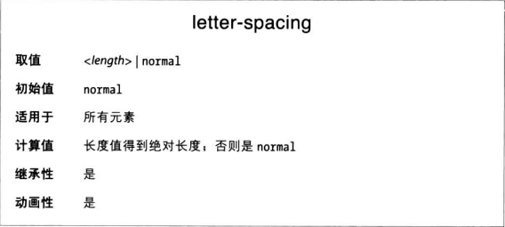

讲完行内元素的纵向对齐方式之后，回到行内方向，说明单词间距和字符间距。与之前一样，这些属性也有一些异于直觉的行为。

### 单词间距 
word-spacing属性值为长度，可正可负，追加到单词标准间距上。

用简单的CSS术语来说，“单词”指的是连侧有空白的非空白字符构成的字符串。

### 字符间距
letter-spacing修改的是字符或字母之间的距离。

啥也不说了，和word-spacing工作方式基本一样。

### 对齐方式对间距的影响
word-spacing的值可能受text-align影响。如果元素是两端对齐，为了让文本占满整行的宽度，可能需要调整字符和单词之间的距离。
如果letter-spacing是长度，不受text-align影响；但如果是noraml，可能要修改字符之间的距离。

注意，继承的是计算得到的值，因此不管子元素的文本大了还是小了，字符间距都与父元素一样。