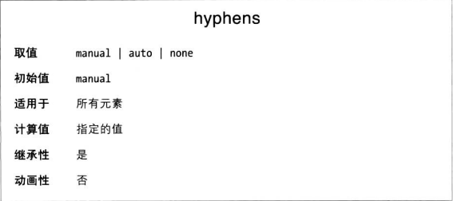
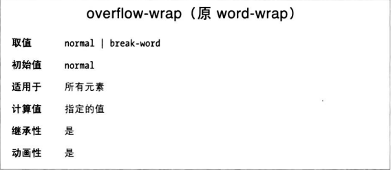

如果遇到单词较长，而行的长度较短，最好加上连字符。借助CSS，无需改动文档就能手动断字。

设为normal时，只在文档中手动插入的连字符处断字。而使用none时，即使有手动插入的连字符也不断字。

设为auto时了，即使没有手动插入连字符，浏览器也会在单词中“合适的”位置断字，把单词分开。CSS规范没有准确定义如何断字，所以不同浏览器断字方式可能不同。断字方式与所用语言有很大关系。

**文本换行**

如果文本超出了所在容器怎么办，这正是overflow-wrap属性要解决的问题。

normal时，按正常方式换行；break-word时，可以在单词内部换行。

**只有white-spoace属性值允许换行时，overflow-wrap才会起作用**