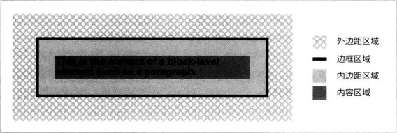

不管是什么元素，CSS都假定每个元素都生成一个或多个矩形，我们称之为元素框。各元素框中心是内容区域，四周有可选的内边距，边框，轮廓和外边距。之所以说可选，是因为它们的宽度都可以设为零。
外边距、边框和内边距都有分别针对每一边的属性，例如margin-left或border-bottom，也有简写属性例如padding。默认情况下，内容区的背景出现在内边距范围内。外边距区域始终是透明的。内边距不能为负值，但是外边距可以。

边框的线型由样式定义，例如设为solid或inset，而颜色由border-color设定。如果未设定颜色，边框的颜色与内容的前景色相同。最后，边框的宽度不能为负数。

元素框各组成部分受很多属性影响，例如width或border-right。

### 重要概念概览

* 常规流动：从左到右，从上到下，以及传统的HTML文档采用的文本布局方式，除非元素浮动了、定位了，放入弹性盒或采用栅格布局了
* 非置换元素：内容包含在文档中的元素。例如，段落（p）是非置换元素，因为段落中的文本内容在元素自身中。
* 置换元素：为其他内容占位的元素。典型的置换元素是img。多数表单也是置换元素。
* 根元素：位于文档树顶端的元素。在HTML中是html。
* 块级框：段落、标题或div等元素生成的框。在常规流动模式下，块级框在框体前后都换行，因此块级框是纵向堆叠的。display: block 声明能把任何元素生成的框体变成块级框。
* 行内框：strong、span等元素生成的框体。行内框前后不换行。display: inline 声明能把人和元素生成的框体变成行内框。
* 行内块级框：内部特征像块级框，外部特征像行内框。
  
### 容纳块
每个元素的框体都想相对容纳块放置。说简单点就是，容纳块是元素框体的“布局上下文”。

在使用常规流动方式渲染的文本中，容纳块由离元素最近的那个生成块级框的祖辈元素的边界构成（最近的块级祖辈元素的内容区）。
