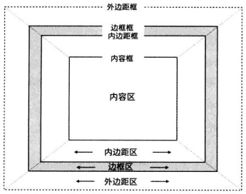
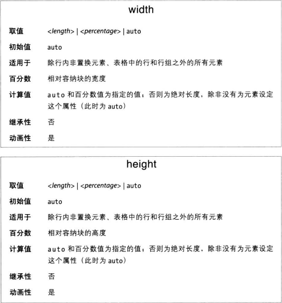

文档中每个元素都会生成一个矩形阵，称之为元素框。这个框体描述元素在文档布局中所占的空间。因此，元素框之间是有影响的，涉及位置和尺寸。
默认情况下，渲染出来的文档中，各矩形框的拍不方式在视觉上不会出现重叠。如果元素框是手动定位的，可能出现重叠。此外在正常流动的元素上应用负外边距，也会出现视觉上的重叠。

### 宽度和高度
通常我们会明确定义一个元素的宽度，但是往往不明确定义高度。默认情况下，元素的宽高指的都是内容区的尺寸。

这两个属性有一点要注意，无法应用到行内非置换元素上。

