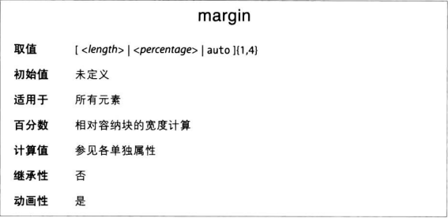
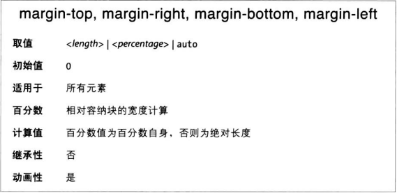

外边距在元素周围添加额外空白。空白一般指其他元素不能共存的区域，而且在这片区域中，父元素的背景是可见的。



margin属性值可以是任何长度值，默认是0。不过浏览器通常会为很多元素提供预设样式，这其中就包含外边距。

### 外边距的长度值

为不同的边设置不同的外边距也不难，前面讲过的值复制行为在这里也适用
```CSS
h1 {margin: 10px 20px 15px 5px}
```

### 外边距的百分数值
与内边距一样，外边距的百分数值相对父元素的内容区宽度计算，因此外边距的具体值随父元素的宽度而变。

### 单边外边距属性


### 外边距折叠
上下外边距会折叠，相邻的两个上下外边距会折叠为其中最大的那个外边距。

### 负外边距
元素的外边距可以设为负值。这可能会使元素框从父元素中冒出来，或与其他元素重叠。